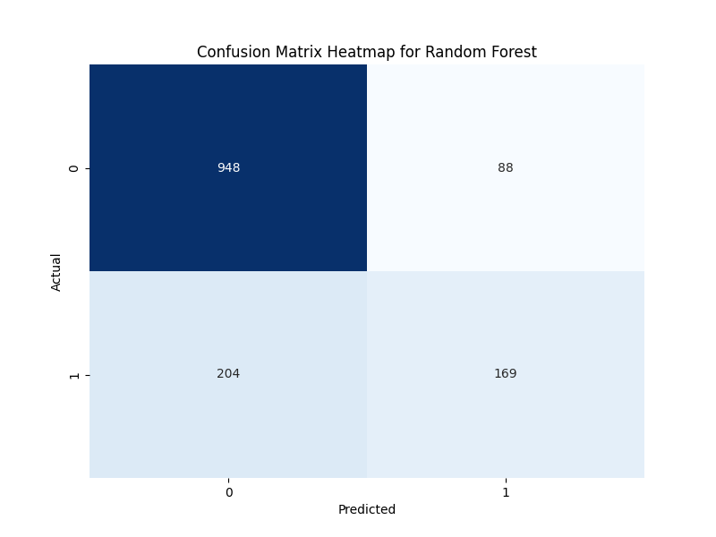
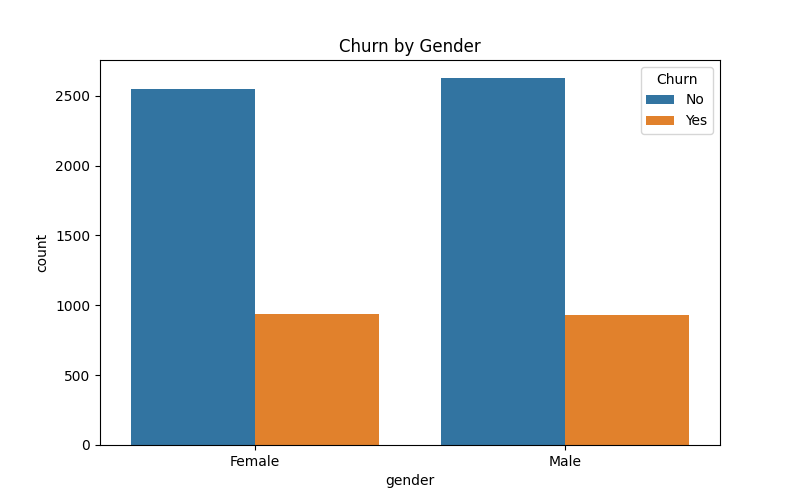
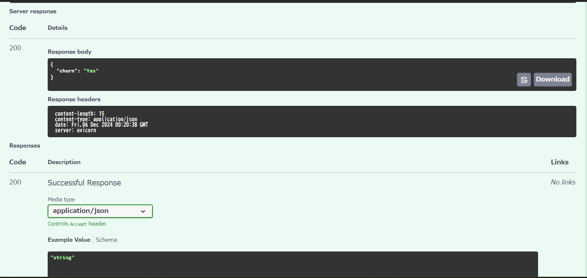
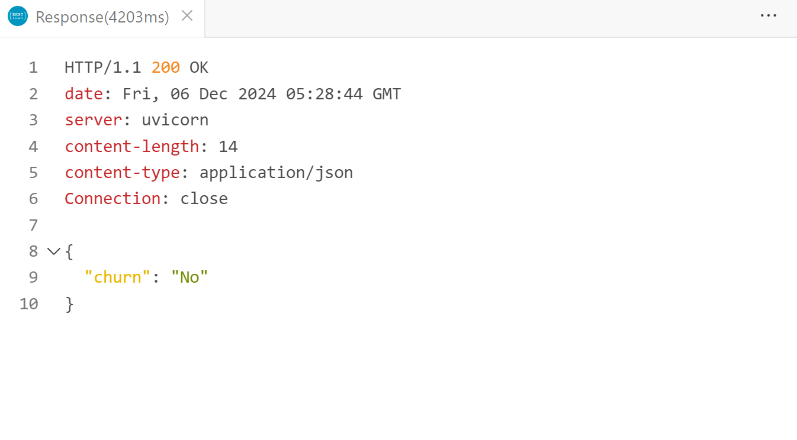

# Customer Churn Analysis

This project demonstrates an end-to-end pipeline for predicting customer churn in the telecommunications industry. It includes:
- Machine Learning model selection and deployment (Random Forest).
- A real-time API for churn prediction using FastAPI.
- Hosting and scaling on Google Cloud Run.

## Getting Started

To quickly start with this project, follow these steps:

1. Clone the repository and navigate to the project folder:
   ```bash
   git clone https://github.com/JourneySculptor/customer-churn-prediction.git
   cd customer-churn-prediction
  ```
2. Install dependencies:
   ```bash
   pip install -r requirements.txt
  ```
3. Run the FastAPI app locally:
   ```bash
   uvicorn main:app --reload
  ```
4. Access the app in your browser at `http://127.0.0.1:8000/docs` to explore the Swagger UI.

## Live Demo
- **Deployed API URL**: [https://churn-analysis-api-500480140.us-central1.run.app](https://churn-analysis-api-500480140.us-central1.run.app)
- **Swagger UI**: [https://churn-analysis-api-500480140.us-central1.run.app/docs](https://churn-analysis-api-500480140.us-central1.run.app/docs)

Explore the live API or test it interactively using Swagger UI.

## Project Overview
This project demonstrates how machine learning can be used to predict **customer churn** in the telecommunications industry. By deploying a Random Forest model as a real-time API using **FastAPI** and **Google Cloud Run**, this project achieves the following:

  - Predict customer churn with a high recall (92%) to minimize false negatives.
  - Deploy a fully functional API that integrates seamlessly into CRM systems or business workflows.
  - Showcase end-to-end infrastructure setup from model training to cloud deployment.

## Purpose of This Project
This project was developed as a part of my portfolio to showcase my skills in:
- End-to-End Machine Learning workflows
- Cloud infrastructure setup and deployment using Docker and Google Cloud Run
- Real-time API design and integration

### Use Cases
- **CRM Integration**: Integrate this API with customer relationship management (CRM) systems to enable real-time churn predictions for targeted marketing campaigns.
- **Proactive Retention**: Use the predictions to proactively offer discounts or rewards to customers identified as likely to churn.
- **Business Insights**: Identify factors contributing to churn and adjust marketing or customer service strategies accordingly.

## Methodology Summary:

  - Built and evaluated **Logistic Regression**, **Random Forest**, and **XGBoost** models.
  - Selected **Random Forest** for deployment due to its balance of accuracy and interpretability.
  - Deployed as a real-time API using **FastAPI**.

## Key Highlights:
- **Deployed API**: A fully functional churn prediction API running on **Google Cloud Run**.
- **Model Selection**: Random Forest was chosen due to its balanced performance and interpretability.
- **Performance**:

  - Recall: 92% (minimizing false negatives)
  - F1-score: 87%

---

## Deployment to Google Cloud Run
The project is deployed using **Google Cloud Run**, which allows serverless hosting of containerized applications. Below are the steps to replicate the deployment.

### Setting Environment Variables
**Note**: This project does not require any environment variables.

All necessary resources (e.g., the trained model and scaler) are packaged within the application. External services such as databases or APIs are not used in this deployment.

If in the future you need to integrate external services, you can refer to the Google Cloud Run documentation for setting up environment variables:
[Google Cloud Run Documentation - Environment Variables](https://cloud.google.com/run/docs/configuring/environment-variables)

### Deployment Steps
1. **Clone the Repository:**
```bash
git clone https://github.com/JourneySculptor/customer-churn-prediction.git
cd customer-churn-prediction
```
2. **Build and Push the Docker Image:**
- Ensure you have Docker installed and configured to authenticate with Google Cloud.
```bash
docker build -t us-docker.pkg.dev/molten-amulet-444008-b8/churn-analysis-api/churn-analysis-api:latest .
docker push us-docker.pkg.dev/molten-amulet-444008-b8/churn-analysis-api/churn-analysis-api:latest
```
3. **Deploy to Cloud Run:** 
- Deploy the container to Google Cloud Run.
```bash
gcloud run deploy churn-analysis-api ^
    --image=us-docker.pkg.dev/molten-amulet-444008-b8/churn-analysis-api:latest ^
    --platform=managed ^
    --region=us-central1 ^
    --allow-unauthenticated
```
4. **Access the Deployed API:**
- After deployment, the service will be accessible at:
  - **Service URL**: [https://churn-analysis-api-500480140.us-central1.run.app](https://churn-analysis-api-500480140.us-central1.run.app)

---

## Dataset Overview
- **Source**: Telecom customer churn dataset
- **Rows**: 7043
- **Columns**: 21
- **Target Variable**: `Churn` (Yes/No)
- **Access**: 
  - This dataset is publicly available on Kaggle.
  - You can download it from the following link and place it in the `data/` folder as `customer_churn.csv`:
    - [Kaggle - Telco Customer Churn Dataset](https://www.kaggle.com/datasets/blastchar/telco-customer-churn)

### Important Note on Dataset Usage
This project **does not include the dataset** due to copyright restrictions. 

#### Steps to Use the Dataset:
1. Download the dataset from the [Kaggle - Telco Customer Churn Dataset](https://www.kaggle.com/datasets/blastchar/telco-customer-churn) provided in the [Dataset Overview](#dataset-overview) section.
2. Place the file in the `data/` directory within the project.
3. Ensure the file is named `customer_churn.csv`.

**Without the dataset**, the project **will not run successfully**. 
If you encounter issues, refer to the [Troubleshooting](#troubleshooting) section for detailed guidance.

#### Using a Dummy Dataset for Testing:
If you don't want to download the full dataset, create a dummy dataset as follows:
1. Place a file named `customer_churn.csv` inside the `data/` directory.
2. Include the following columns:
  - `customerID, gender, SeniorCitizen, Partner, Dependents, tenure, PhoneService, MultipleLines, InternetService, OnlineSecurity, OnlineBackup, DeviceProtection, TechSupport, StreamingTV, StreamingMovies, Contract, PaperlessBilling, PaymentMethod, MonthlyCharges, TotalCharges, Churn`


### Skills Demonstrated
- **Data Preprocessing**: Handling missing values, encoding categorical features.
- **Exploratory Data Analysis (EDA)**: Visualizing churn correlations with various features.
- **Machine Learning**: Model training, hyperparameter tuning, and evaluation.
- **API Development**: Deploying a trained model using **FastAPI**.
- **Version Control**: Managing the project with **Git**.
- **Deployment Skills**: Using Replit to host APIs and managing API testing workflows.

---

## Methodology
1. **Data Cleaning**
    - Converted `TotalCharges` to numeric and handled missing values.
    - One-hot encoding for categorical variables (e.g., `Contract`, `InternetService`).
    - Binned `tenure` into categories for better interpretability.

2. **Exploratory Data Analysis (EDA)**
    - Visualized churn distribution by features like `Contract` and `MonthlyCharges`.
    - Examined correlations and feature importance.

3. **Model Building**
    - Trained Logistic Regression, Random Forest, and XGBoost models.
    - Hyperparameter tuning for Random Forest using grid search.

4. **Model Evaluation**
    - Compared models using accuracy, precision, recall, and F1-score.
    - Selected Random Forest for deployment due to its high recall and balanced F1-score.

## Results
### Model Comparison
| Model              | Accuracy | Precision | Recall | F1-Score |
|--------------------|----------|-----------|--------|----------|
| Logistic Regression | 81.33%   | 0.85      | 0.90   | 0.88     |
| Random Forest       | 79.27%   | 0.82      | 0.92   | 0.87     |
| XGBoost             | 80.12%   | 0.80      | 0.91   | 0.85     |

### Model Insights
- **Logistic Regression** achieved the highest accuracy but had slightly lower recall than Random Forest.
- **Random Forest** recall score of 92% ensures the model is effective at identifying customers likely to churn, minimizing false negatives.
- **XGBoost** showed solid performance but was outperformed by Random Forest and Logistic Regression in terms of precision and F1-score.

### Visualizations
- **Confusion Matrix Heatmap**:
  
- **Churn by Gender**:
  


## Endpoints and API Usage
### 1. Test the API Health:
- URL: `/`
- Method: `GET`
- Response:
```json
{"message": "API is running successfully"}
```
### Predict Customer Churn:
- URL: `/predict`
- Method: `POST`
- Request Body:
```json
{
    "gender": "Female",
    "SeniorCitizen": 0,
    "Partner": "Yes",
    "Dependents": "No",
    "tenure": 12,
    "PhoneService": "Yes",
    "MultipleLines": "No",
    "InternetService": "Fiber optic",
    "OnlineSecurity": "No",
    "OnlineBackup": "Yes",
    "DeviceProtection": "Yes",
    "TechSupport": "No",
    "StreamingTV": "No",
    "StreamingMovies": "Yes",
    "Contract": "One year",
    "PaperlessBilling": "Yes",
    "PaymentMethod": "Electronic check",
    "MonthlyCharges": 90.65,
    "TotalCharges": 1083.3
}
```
- Response:
```json
{"churn": "Yes"}
```
### Swagger UI 
After deployment, Swagger documentation will be accessible at `/docs`:

   - Example: `https://churn-analysis-api-xxxxx.run.app/docs`

## Example Usage (Step-by-Step)

This section demonstrates how to test the deployed API using **Postman** and the command line (`curl`).

### 1. When to Use Postman or `curl`
- Use **Postman** for interactive testing with a graphical interface. Ideal for beginners or if you want to visually inspect and tweak your requests.
- Use **curl** for quick, automated testing via the command line.


### 2. Postman Collection
The `postman_collection.json` file contains pre-configured API requests for the `/predict` endpoint. Import this file into Postman to quickly test the API without manual setup.

**Download Postman Collection**: [postman_collection.json](postman_collection.json)

**Steps to Use:**
1. Download the `postman_collection.json` file from this repository.
2. Open Postman and click the "Import" button.
3. Select the downloaded `postman_collection.json`.
4. Run the `/predict` endpoint with the pre-configured settings.

**Manual Testing (if you don't use Postman Collection):**
- Set up a POST request to the endpoint: `https://churn-analysis-api-500480140.us-central1.run.app/predict`.
- Add the JSON payload under the "Body" tab (see the example in the section "Testing with Postman").


### 3. Using `curl` from the Command Line
You can use the `curl` command to test the API directly from the command line.

- **Example Command**:
  ```bash
  curl -X POST \
    'https://churn-analysis-api-500480140.us-central1.run.app/predict' \
    -H 'Content-Type: application/json' \
    -d '{
        "gender": "Female",
        "SeniorCitizen": 0,
        "Partner": "Yes",
        "Dependents": "No",
        "tenure": 12,
        "PhoneService": "Yes",
        "MultipleLines": "No",
        "InternetService": "Fiber optic",
        "OnlineSecurity": "No",
        "OnlineBackup": "Yes",
        "DeviceProtection": "Yes",
        "TechSupport": "No",
        "StreamingTV": "No",
        "StreamingMovies": "Yes",
        "Contract": "One year",
        "PaperlessBilling": "Yes",
        "PaymentMethod": "Electronic check",
        "MonthlyCharges": 90.65,
        "TotalCharges": 1083.3
    }'
  ```
- Expected Response:
```json
{
  "churn": "No"
}
```

## How to Test the API
### 1. Cloning the Repository
Clone this repository to your local machine using Git:
```bash
git clone https://github.com/JourneySculptor/customer-churn-prediction.git
cd customer-churn-prediction
```
### 2. Installing Dependencies
```bash
pip install -r requirements.txt
```
### 3. Running Locally
To run the FastAPI app locally, navigate to the project directory and use Uvicorn to launch the app:
```bash
uvicorn main:app --reload
```
The application will be accessible at `http://127.0.0.1:8000` in your browser.

- Input data in the provided JSON format.
   - Example POST request:
```json
   {
      "gender": "Female",
      "SeniorCitizen": 0,
      "Partner": "Yes",
      "Dependents": "No",
      "tenure": 12,
      "PhoneService": "Yes",
      "MultipleLines": "No",
      "InternetService": "Fiber optic",
      "OnlineSecurity": "No",
      "OnlineBackup": "Yes",
      "DeviceProtection": "Yes",
      "TechSupport": "No",
      "StreamingTV": "No",
      "StreamingMovies": "Yes",
      "Contract": "One year",
      "PaperlessBilling": "Yes",
      "PaymentMethod": "Electronic check",
      "MonthlyCharges": 90.65,
      "TotalCharges": 1083.3
   }
```
This should return a prediction response, similar to:
```json
{
  "prediction": "Yes"
}
```

### 4. Testing the API
You can test the API using `curl` or Postman. Here's an example `POST` request:

#### Endpoint: `/predict`
- **Method**: `POST`
- **Description**: Predict customer churn based on input data.

#### Request Example:
```json
{
  "gender": "Female",
  "SeniorCitizen": 0,
  "Partner": "Yes",
  "Dependents": "No",
  "tenure": 12,
  "PhoneService": "Yes",
  "MultipleLines": "No",
  "InternetService": "Fiber optic",
  "OnlineSecurity": "No",
  "OnlineBackup": "Yes",
  "DeviceProtection": "Yes",
  "TechSupport": "No",
  "StreamingTV": "No",
  "StreamingMovies": "Yes",
  "Contract": "One year",
  "PaperlessBilling": "Yes",
  "PaymentMethod": "Electronic check",
  "MonthlyCharges": 90.65,
  "TotalCharges": 1083.3
}
```
**Response Example:**
```json
{
  "churn": "No"
}
```
**Testing with curl:**
```json
curl -X POST \
  'https://churn-analysis-api-500480140.us-central1.run.app/predict' \
  -H 'accept: application/json' \
  -H 'Content-Type: application/json' \
  -d '{
    "gender": "Female",
    "SeniorCitizen": 0,
    "Partner": "Yes",
    "Dependents": "No",
    "tenure": 12,
    "PhoneService": "Yes",
    "MultipleLines": "No",
    "InternetService": "Fiber optic",
    "OnlineSecurity": "No",
    "OnlineBackup": "Yes",
    "DeviceProtection": "Yes",
    "TechSupport": "No",
    "StreamingTV": "No",
    "StreamingMovies": "Yes",
    "Contract": "One year",
    "PaperlessBilling": "Yes",
    "PaymentMethod": "Electronic check",
    "MonthlyCharges": 90.65,
    "TotalCharges": 1083.3
  }'
```

### Swagger UI: Testing and Results
You can use Swagger UI to explore the API's functionality and test its endpoints interactively.

1. **Access URL**:  
   - For local testing: `http://127.0.0.1:8000/docs`  

2. **Testing Steps**:  
   - Click the **"Try it out"** button for the `/predict` endpoint.  
   - Enter the required JSON data in the provided fields.  
   - Press **"Execute"** to get the prediction result.

3. **Sample Response**:
```json
{
  "prediction": "Yes"
}
```
4. **Example Screenshot**: Below is a successful API response tested using the REST Client extension in Visual Studio Code: 




## Troubleshooting

Here are some common errors you might encounter while running the API and their solutions:

1. **500 Internal Server Error**:
   - **Cause**: Missing dependencies or the required data file is not found.
   - **Solution**:
     - Install dependencies:
       ```bash
       pip install -r requirements.txt
       ```
     - Ensure the dataset is correctly placed in the `data/` directory.
2. **API Not Responding**:
   - **Cause**: Misconfigured container or port.
   - **Solution**:
     - Check that `PORT` environment variable is set to `8080` in the code.
     - Verify the Dockerfile exposes port `8080`.
3. **Permission Errors**:
   - **Cause**: Missing permissions for Google Cloud services.
   - **Solution**:
     - Ensure the Google Cloud project has all necessary APIs enabled (`Cloud Run`, `Artifact Registry`).
   - Verify service account roles and bindings.


## How to Contribute
1. Fork the repository
2. Create your feature branch: `git checkout -b feature/your-feature`
3. Commit your changes: `git commit -am 'Add new feature'`
4. Push to the branch: `git push origin feature/your-feature`
5. Create a new Pull Request

---

## Files and Directory Structure
```bash
churn_analysis_project/
├── main.py                 # Starts the FastAPI application for predictions.
├── api.py                  # Handles API endpoints and prediction logic.
├── analysis.py             # Contains data analysis and model training code.
├── download_data.py        # Script to download dataset from Kaggle or Google Cloud Storage.
├── requirements.txt        # Lists all dependencies required to run the project.
├── postman_collection.json # Pre-configured Postman Collection for API testing
├── Dockerfile              # Docker container configuration for deployment.
├── Procfile                # Defines deployment commands.
├── README.md               # Project documentation and setup instructions.
├── .gitignore              # Specifies files and directories to ignore in version control.
├── data/                   # Directory to store local dataset for testing.
│   ├── dummy_customer_churn.csv  # Dummy dataset for local testing.
├── results/                # Contains model and visualization outputs.
│   ├── rf_model.joblib     # Saved Random Forest model for predictions.
│   ├── scaler.joblib       # StandardScaler for preprocessing features.
│   ├── features.txt        # List of features used for model training.
│   ├── confusion_matrix.png # Confusion matrix heatmap.
│   ├── churn_by_gender.png # Visualization of churn rates by gender.
└── tests/                  # Optional: Unit tests for APIs and core functionality.
```
## Requirements
- Python 3.12+
- FastAPI
- Uvicorn
- scikit-learn
- joblib
- pandas
- pydantic

---

## Technologies Used
- **Python**: Pandas, NumPy, Scikit-learn, Matplotlib, Seaborn, XGBoost
- **Framework**: FastAPI, Uvicorn
- **Deployment**: Replit (for easy hosting and deployment)

## Future Improvements
1. **Improve Model Performance**: Experiment with advanced ensemble methods or deep learning models to boost accuracy and recall.
2. **Add Monitoring and Analytics**: Integrate a dashboard for tracking prediction trends and performance metrics.
3. **Scalability**: Implement horizontal scaling strategies to handle high-traffic use cases.
4. **Enhance Data Diversity**: Incorporate more diverse datasets to reduce potential bias and improve generalizability.

---

## Limitations
While this project provides a robust foundation for churn prediction, there are some limitations:

1. **Data Bias**: The model relies on a specific dataset, which may not represent all customer demographics or regions.
2. **Feature Constraints**: Some important features that could improve prediction accuracy may be missing from the dataset.
3. **Model Scalability**: The current deployment setup might not scale well for large, high-frequency requests without additional optimizations.
4. **Interpretability**: Although Random Forest provides feature importance, it lacks the full interpretability of simpler models like Logistic Regression.

Addressing these limitations through advanced techniques and broader datasets is a potential area for future development.

---

## Conclusion
This project demonstrates how machine learning can be used to predict customer churn in the telecommunications industry. By comparing various models, a **Random Forest** model was chosen for deployment due to its accuracy and interpretability. This project provides a foundation for building real-time prediction systems that can be integrated into business operations to help retain valuable customers.

---

## Contribution
Feel free to fork this repository and submit pull requests with improvements or new features.

## License
MIT License
